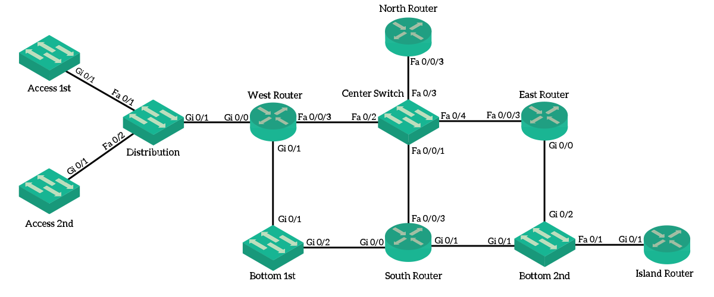

The script is intended to automatically put the correct desription on every port.
The script collects all cdp neighbor information from all ports.
It then configures the collected hostname information on the corresponding interface (incl. Port-channel)
The script is able to perform the update on multiple devices in parallel. This makes it possible to run the script on many devices at once.

Please create the neccessary inventory files (see in inventory folder) that nornir works with, and adjust them to your enviroment.
For that please use the following files:

    config.yaml ---> basis config of how nornir should handle connections and where to gather informations
    defaults.yaml ---> can be left empty, but must be present as a file
    groups.yaml ---> is used to group your hosts an provide a plattform info (used for authentication)
    hosts.yaml ---> is used to put in the hosts you want to run the scripts against in yaml format
