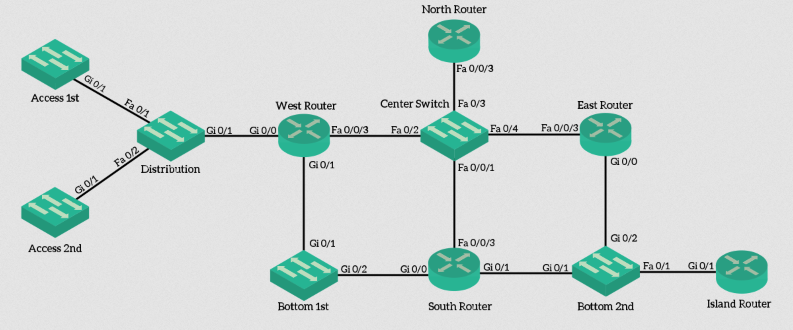

The script is intended to automatically put the correct desription on every port.
The script collects all cdp neighbor information from all ports.
It then configures the collected hostname information on the corresponding interface (incl. Port-channel)
The script is able to perform the update on multiple devices in parallel. This makes it possible to run the script on many devices at once.

